# SpringCloud & SpringCloud Alibaba(一套标准化的微服务解决方案)

## member-service-provider-10000

### mysql

```mysql
CREATE DATABASE IF NOT EXISTS e_commerce_center_db;
USE e_commerce_center_db;
CREATE TABLE `member` (
	`id` BIGINT NOT NULL AUTO_INCREMENT COMMENT 'id',
	`name` VARCHAR(64) COMMENT '用户名',
	`pwd` CHAR(32) COMMENT '密码',
	`mobile` VARCHAR(20) COMMENT '手机号码',
	`email` VARCHAR(64) COMMENT '邮箱',
	`gender` TINYINT COMMENT '性别',
	PRIMARY KEY (`id`)
);

INSERT INTO `member` VALUES 
	(NULL, 'charlie', MD5('123'), '123456789545', 'charlie@gmail.com', 1),
	(NULL, 'snow', MD5('456'), '123568975520', 'snow@163.com', 0);

SELECT * FROM `member`;
```

### Dao

- 注意在 `MemberDao.java` 上加入注解 `@Mapper`，才会注入bean
- [MemberDao](member-service-provider-10000/src/main/java/com/charlie/springcloud/dao/MemberDao.java)
- [MemberMapper.xml](member-service-provider-10000/src/main/resources/mapper/MemberDao.xml)

### Service

- 注意在 `MemberServiceImpl.java` 上加入注解 `@Service`
- 在注入装配时，使用 `@Service` 注解 `private MemberService memberService;`
- [MemberService](member-service-provider-10000/src/main/java/com/charlie/springcloud/service/MemberService.java)
- [MemberServiceImpl](member-service-provider-10000/src/main/java/com/charlie/springcloud/service/impl/MemberServiceImpl.java)

### Controller

```java
package com.charlie.springcloud.controller;

@Slf4j
@RestController
public class MemberController {

    // 装配MemberService
    @Resource
    private MemberService memberService;

    /**
     * 添加方法/接口
     * 1. 如果前端是以json格式发送数据，那么需要使用参数注解 @RequestBody 才能将数据封装到对应的bean，
     *      同时保证http的请求头的 content-type 是对应的 application/json
     * 2. 如果前端是以 表单 形式提交的，则不需要注解 @RequestBody 才能封装，
     *      对应的 content-type 为 application/x-www-form-urlencoded
     */
    @PostMapping("/member/save")
    public Result save(Member member) {
        int affected = memberService.save(member);
        if (affected > 0) {
            return Result.success("添加会员成功", affected);
        }
        return Result.error("401", "添加会员失败");
    }

    /**
     * 查询的方法/接口
     */
    @GetMapping("/member/get/{id}")
    public Result getMemberById(@PathVariable(name = "id") Long id) {
        Member member = memberService.queryMemberById(id);
        if (member != null) {
            return Result.success("查询成功", member);
        }
        return Result.error("402", "ID=" + id + "的会员不存在");
    }
}
```

### 注意事项和细节

> 1. 在进行SpringBoot应用程序测试时，引入的JUnit是`org.junit.jupiter.api.Test`
> 2. 在运行程序时，一定要确保你的`XxxMapper.xml`文件被自动放到的`target`目录的`classes`指定目录

### 创建共用模块

## Eureka

- SpringCloud组件选型
  - 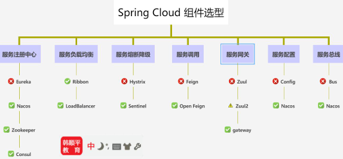
- 引出`Eureka`
  - 在企业级项目中，服务消费访问请求会存在高并发。会员中心提供服务往往是一个集群，也就是说会有多个会员中心提供服务微服务模块
  - 就存在一个问题就是**服务消费方，怎么去发现可以使用的服务**
  - 当服务消费方，发现了可以使用的服务后(可能是多个，又存在一个问题就是**到底调用A服务，还是B服务的问题**，这就引出了服务注册和负载均衡
  - 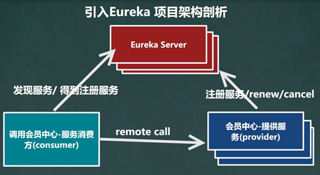
- Eureka包含两个组件∶`EurekaServer`和`EurekaClient`
  - `Eureka Server`提供**注册服务**, 各个微服务节点通过配置启动后，会在EurekaServer中进行注册，这样EurekaServer中的**服务注册表中将会存储所有可用服务节点的信息**，服务节点的信息可以在界面中直观看到。
  - `EurekaClient`通过注册中心进行访问, 是一个Java客户端，用于简化EurekaServer的交互，客户端同时也具备一个内置的、使用轮询(round-robin) 负载算法的负载均衡器。
    在应用启动后，将会向EurekaServer发送心跳(默认周期为30秒)。如果EurekaServer在多个心跳周期内没有接收到某个节点的心跳，EurekaServer将会从服务注册表中把这个服务节点移除(默认90秒)

### 架构示意图

- 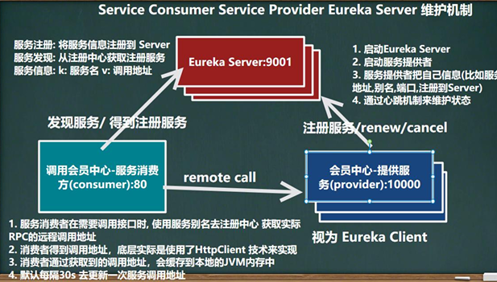

### Eureka自我保护机制

- 默认情况下EurekaClient定时向EurekaServer端发送心跳包
- 如果Eureka在server端在一定时间内（默认90秒）没有收到EurekaClient发送心跳包，便会直接从服务注册列表中剔除该服务
- 如果Eureka开启了自我保护模式/机制,那么在短时间（90秒中）内丢失了大量的服务实例心跳，这时候EurekaServer会开启自我保护机制，不会剔除该服务
- 自我保护是属于**CAP里面的AP分支**，保证高可用和分区容错性
- 架构哲学是**宁可同时保留所有微服务（健康的微服务和不健康的微服务都会保留）也不盲目注销任何健康的微服务**

### 搭建Eureka集群-实现负载均衡&故障容错

### DiscoveryClient

- 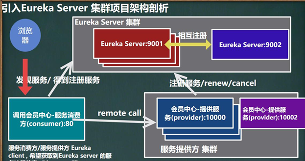
- 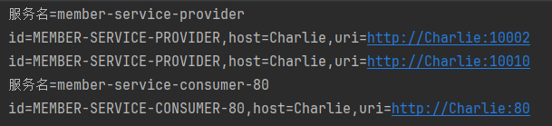

1. 修改`Controller`装配`DiscoveryClient`
2. 修改主启动类，增加注解`@EnableDiscoveryClient`，启动服务发现

```
// 装配DiscoveryClient
// 引入的是接口 org.springframework.cloud.client.discovery.DiscoveryClient;
@Resource
private DiscoveryClient discoveryClient;

@GetMapping("/member/consumer/discovery")
public Object discovery() {
    List<String> services = discoveryClient.getServices();
    for (String service : services) {
        log.info("服务名={}", service);
        // 通过服务名获取实例对象的集合
        List<ServiceInstance> instances = discoveryClient.getInstances(service);
        for (ServiceInstance instance : instances) {
            log.info("id={},host={},uri={}", instance.getServiceId(), instance.getHost(), instance.getUri());
        }
    }
    return discoveryClient;
}
```

## Ribbon

- Ribbon就是负载均衡+RestTemplate调用

### LB(Load Balance)

1. 集中式LB
   - 即在服务的消费方和提供方之间使用独立的LB设施（可以是硬件如F5，也可以是软件如Nginx），由该设施负责把访问请求通过某种策略转发至服务的提供方
   - 
2. 进程内LB
   - 将LB逻辑集成到消费方，消费方从服务注册中心获知有哪些服务地址可用，然后在这些地址中选择出一个合适的服务地址。
   - `Ribbon`就属于进程内LB，它只是一个类库，集成于消费方进程，消费方通过它来获取到服务提供方的地址
   - 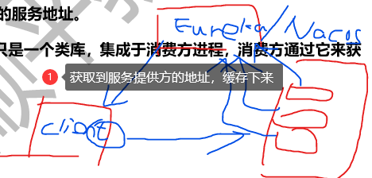

### Ribbon原理

- 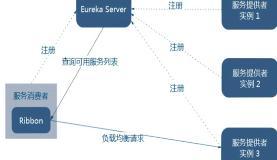
- 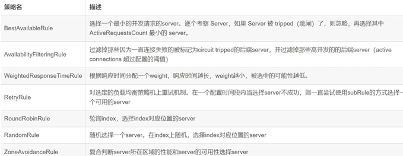
1. 先选择EurekaServer，优先选择在同一个区域内负载较少的server
2. 再根据用户指定的策略，再从server获取到的服务注册列表中选择一个地址
3. Ribbon提供了多种策略：比如轮询、随机和根据响应时间加权

## OpenFeign

1. `OpenFeign`是个声明式WebService客户端
2. **使用方法是定义一个服务接口然后在上面添加注解**
3. OpenFeign也支持可拔插式的编码器和解码器
4. SpringCloud对OpenFeign进行了封装使其支持了SpringMVC标准注解和HttpMessageConverters
5. OpenFeign可以与Eureka和Ribbon组合使用以支持负载均衡
- 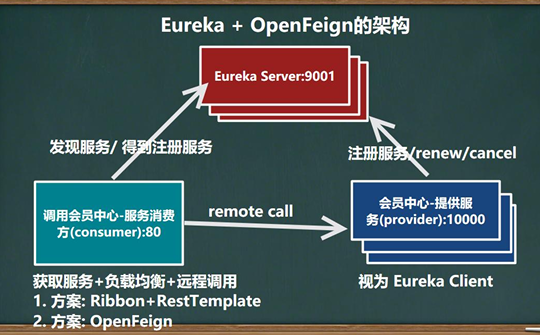

### 服务调用

### 日志配置

### 调用超时

## Gateway

| 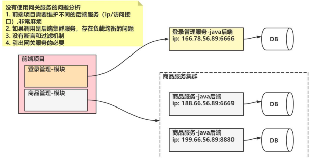   |
|------------------------------|
| 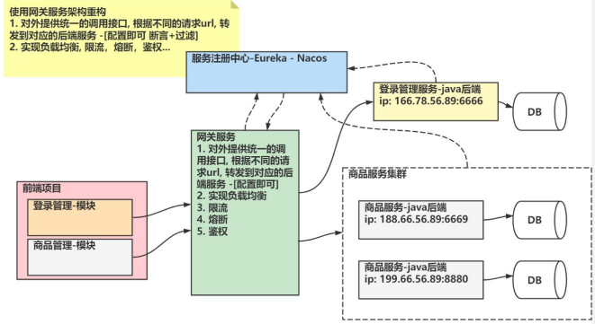    |
| 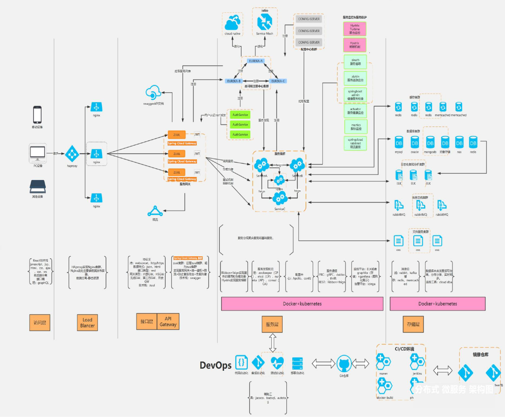 |

### Gateway介绍

1. Gateway是在Spring生态系统之上构建的**API网关服务**，基于Spring，SpringBoot和ProjectReactor等技术
2. Gateway旨在提供一种简单而有效的方式来对API进行路由，以及提供一些强大的过滤器功能，如熔断、限流、重试等
3. GateWay核心功能：鉴权、流量控制、熔断、日志监控和反向代理
4. SpringCloud Gateway作为SpringCloud生态系统中的网关，目标是替代Zuul。
5. GateWay基于SpringWebFlux框架实现，WebFlux框架底层则使用了高性能的Reactor模式通信框架Netty，提升了网关性能
6. 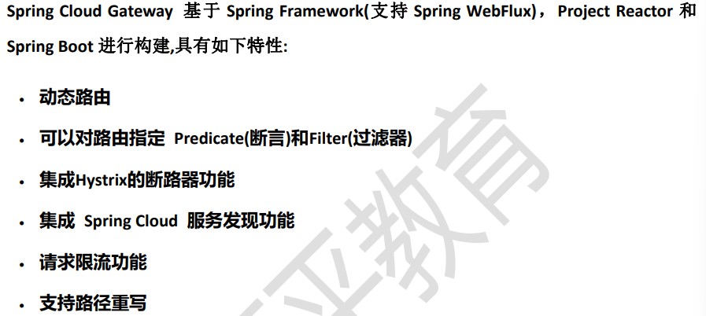
7. 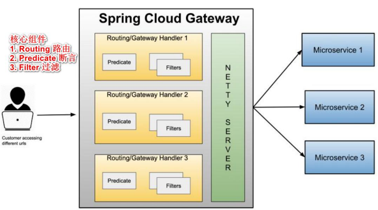
    1) web请求**通过一些匹配条件，定位到真正的服务节点/微服务模块，在这个转发过程的前后，进行一些精细化控制**
   2) `predicate`：就是匹配条件
   3) `filter`：可以理解位是网关的过滤机制。有了predicate和filter，再加上目标URL就可以实现一个具体的路由
8. 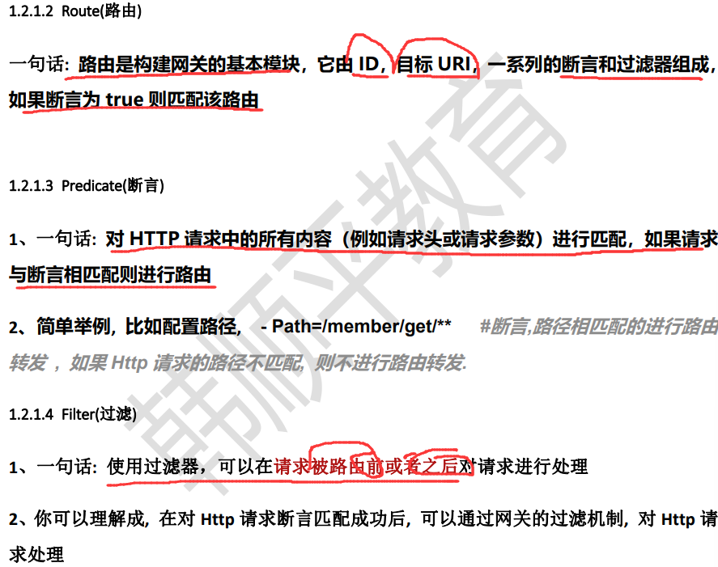
9. 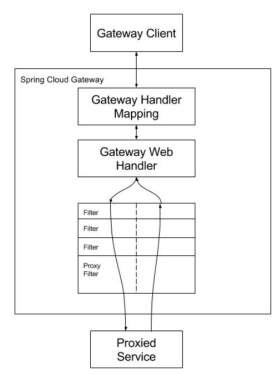
   1) 客户端向Spring Cloud Gateway发出请求。然后在`Gateway Handler Mapping`中找到与请求相匹配的路由，将其发送到`Gateway Web Handler`
   2) `Handler`再通过指定的**过滤器链**来将请求发送到我们实际的服务执行业务逻辑，然后返回
   3) 过滤器之间用虚线分开是因为过滤器可能会在发送代理请求之前("pre")或之后("post")执行业务逻辑
   4) Filter在"pre"类型的过滤器可以做**参数校验、权限校验、流量监控、日志输出、协议转换**等
   5) 在"post"类型的过滤器中可以做**响应内容、响应头的修改，日志的输出，流量监控**等有着非常重要的作用
   6) 一句话：**路由转发+执行过滤器链**
